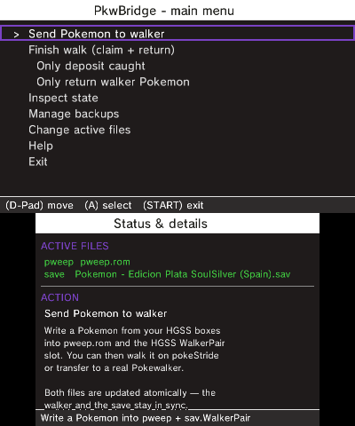

# PkwBridge

**A bridge between the PokéWalker and Pokémon HeartGold/SoulSilver.**

PkwBridge is a Nintendo 3DS app that sends a Pokémon from your HeartGold/SoulSilver save
to a PokéWalker, and brings back what you caught when you're done — all by editing files
on the SD card, with **no infrared** needed.

It was built together with **[PokeStride](https://github.com/edgarburgues/pokestride)**, a
PokéWalker emulator, so you can do the whole loop on a single 3DS.

> Beta: it edits your save and the walker's memory directly. It keeps automatic backups,
> but please keep your own too.

<p align="center"></p>

## What it does

- **Send** a Pokémon (and a walking route) from your save to the walker.
- **Finish a walk** — deposit the Pokémon and the items you found, return the one you
  sent, and sync your steps and watts.
- **Inspect** your save and the walker (read-only), and **manage backups**.

## Get it

1. Grab the latest build from [**Releases**](https://github.com/edgarburgues/pkwbridge/releases)
   — the `.3dsx`, or the `.cia` if you'd rather install it like a normal app.
2. Copy the `.3dsx` to `sdmc:/3ds/pkwbridge/` (or install the `.cia` with FBI).
3. Have your `pweep.rom` (the walker's memory) and your `.sav` somewhere on the SD card.
4. Open it, accept the beta notice, pick your files, and use the menu.

> Need a `pweep.rom`? Dump a real walker, or just use the one PokeStride keeps. On the
> first launch PkwBridge also reads a HeartGold/SoulSilver ROM once to grab the sprites for
> previews — see the wiki for details (it works without them too).

## What works

| | |
|---|---|
| ✅ | Send, finish-walk (deposit + return), inspect, backups, switch files |
| ✅ | Deposits the Pokémon **and** the items you found while walking |
| ⚠️ | Verified on **European 1.1** saves — other regions/languages may need offset tweaks |
| ⚠️ | The full loop with a **physical** walker hasn't been confirmed on hardware yet |
| ⚠️ | **HeartGold/SoulSilver only** for now — see below |

## Adding more games

PkwBridge and PokeStride were made together as a pair. Today they target
HeartGold/SoulSilver, but the code is structured to make adding other games — newer **and**
older — straightforward. The big remaining job for newer generations is recreating their
sprites; I'm not an artist, so that part is happily left to the community ❤️.

## Build it yourself

Needs devkitARM + libctru/citro2d. With Docker (no local devkitPro):

```bash
MSYS_NO_PATHCONV=1 docker run --rm -v "$(pwd -W):/project" -w /project \
    devkitpro/devkitarm:latest bash -c "make"
```

Or `make` with a native devkitPro install. Output: `pkwbridge.3dsx`.

## Learn more

The **[wiki](https://github.com/edgarburgues/pkwbridge/wiki)** covers the architecture,
the save / PokéWalker-EEPROM / PK4 formats, the send-claim-return flow, and the on-device
NDS data extraction.

## Credits & license

- App icon by **[Lalogo](https://lalogo.dev/)** ([github.com/la-lo-go](https://github.com/la-lo-go)).
- PokéWalker reverse engineering by [Dmitry.gr](https://dmitry.gr/?r=05.Projects&proj=28.%20pokewalker);
  Gen 4 save/PK4 format references from the PKHeX / Project Pokémon community.

Licensed under the **GNU GPLv3** — see [`LICENSE`](LICENSE). Your PokéWalker EEPROM and
HGSS save/ROM files are Nintendo property and are **not** included.
